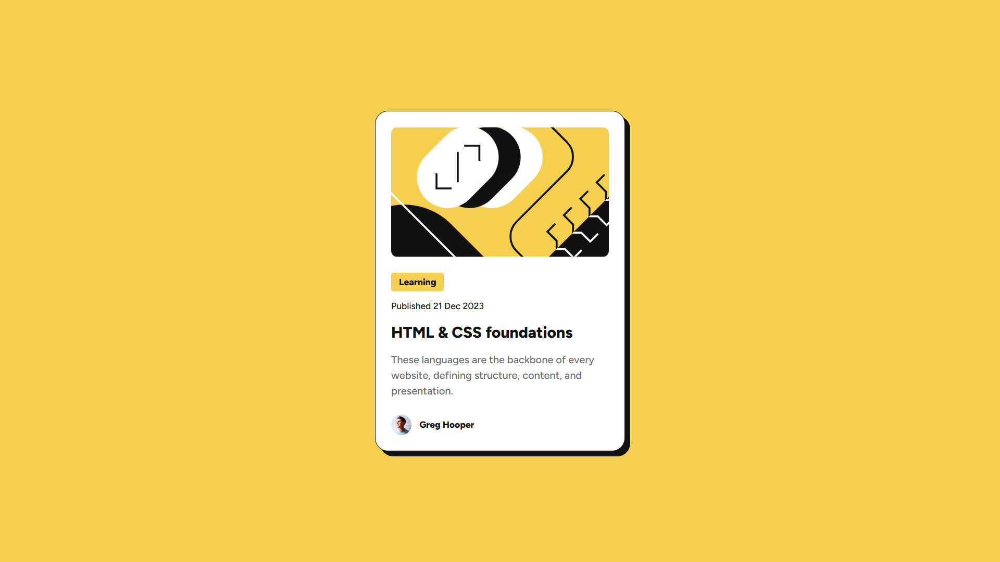

# blog-preview-card
This is a solution for the Blog preview card challenge on Frontend Mentor.

## Table of contents

- [blog-preview-card](#blog-preview-card)
  - [Table of contents](#table-of-contents)
  - [Overview](#overview)
    - [The challenge](#the-challenge)
    - [Screenshot](#screenshot)
    - [Links](#links)
  - [My process](#my-process)
    - [Built with](#built-with)
    - [What I learned](#what-i-learned)
    - [Continued development](#continued-development)
  - [Author](#author)

## Overview

### The challenge

Users should be able to:
- See hover and focus states for all interactive elements on the page

### Screenshot



### Links

- Solution URL: [rizanne-f/blog-preview-card](https://github.com/rizanne-f/blog-preview-card)
- Live Site URL: [rizanne-f.github.io/blog-preview-card/](https://rizanne-f.github.io/blog-preview-card)

## My process

### Built with

- Semantic HTML5 markup
- CSS custom properties
- Flexbox
- Mobile-first workflow

### What I learned

We can take advantage of Flexbox to set the gap between elements instead of using margin-bottom multiple times in different selectors.
```html
<article class="blog-preview">
    
    <div class="card-content">...</div>
    <footer class="card-footer">...</footer>
</article>
```
```css
.blog-preview {
    display: flex;
    flex-direction: column;
    gap: 24px;
}
```

I also keep forgetting that we can change specific ancestor property when the parent container is selected via the descendant selector.
```css
.blog-preview:hover .blog-title {
    color: var(--Yellow);
}
```

### Continued development

In this exercise, I applied Media Queries to replace font sizes in Desktop screens but I would like to learn better practices regarding responsive font.
```css
@media screen and (min-width: 376px) {
    .blog-tag, .date-published { font-size: var(--fs-small); }
    .blog-title { font-size: var(--fs-large); }
    .blog-description { font-size: var(--fs-medium); }
}
```

## Author

- LinkedIn - [Rizanne Fernandez](https://ph.linkedin.com/in/rizanne-fernandez)
- Frontend Mentor - [@rizanne-f](https://www.frontendmentor.io/profile/rizanne-f)
